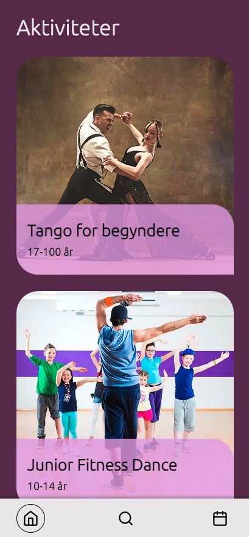

# Dokumentation for Landrup Dans - Termins prøve
Liva Kuhlmann, WU12 - Hovedforløb



## Sådan kommer du i gang
Api'et findes på https://github.com/rts-Liva/landrup-dans-api

`npm i`

`npm run dev`

## Valg af valgfri opgave
Jeg har lavet valgfri opgave B
Jeg har lavet valgfri opgave C

## Tech-stack
### React
* React er et front-end bibliotek der giver mulighed for at opdele kode i komponenter og håndtere states på et let og overskuelig måde.
* React er meget anvendt, godt dokumenteret, understøttet og har stor efterspørgelse på udviklere.

### Next.js
* Next.js er et front-end framework baseret på React.
* I Next.js er der bl.a. adgang til server-side komponenter, server-actions og mappe-baseret routing.
* Server-side komponenter og funktioner's sikkerhed er større da alt koden afvikles i serveren i stedet for klienten.

### Git
* Git er et versionsstyringsværktøj, som giver muligheden for lave branches og versioner af koden, så det er let at gå tilbage til tidligere versioner, hvis behovet for ændringer ankommer.
* Jeg har valgt at bruge Git sammen med Github.

### Zod
* Zod er et valideringsbibliotek hvor man kan lave schemas til at validere data fra simple strings, til komplekse objects.
* I dette projekt har jeg anvendt Zod til at validere bruger-input fra formularer.

### RESTful Web-API
* Jeg bruger et REST (REpresentational State Transfer) API --hvilket er en undergruppe af Web API-- til at få adgang til Landrup Dans' data via et interface.

### SASS
* Sass er en udvidelse til CSS, som giver muligheden til at lave variabler, nesting, mixins og funktioner.
* Sass er stort udbredt.
* Jeg har valgt Sass for dens evne til at simpelt opdele CSS i moduler og dermed kan jeg genbruge kode flere steder.

### React-icons
* React-icons er et ikon-bibliotek, anvendt til React.
* React-icons er smart da den kun importere de ikoner der bliver brugt i projektet.

### React-spinners
* React-spinners er et loading-spinners-bibliotek, anvendt til React.
* React-spinners giver mig nem mulighed for at interagere loading animationer uden meget besvær.
* Dog er versionen stadig i alpha, så andre muligheder kunne overvejes.

## Kode eksempel
ActivityDetails komponent (components/cards/activity-details.jsx)
```jsx
function ActivityDetails({ id, user }) {
    const { data, error, loading } = useFetch(`activities/${id}`);

    const userIsParticipating = user?.activities.some(activity => activity?.id === data?.id);
    const userIsAvailable = !(user?.activities.some(activity => activity?.weekday === data?.weekday));
    const userTooYoung = user?.age < data?.minAge;
    const userTooOld = user?.age > data?.maxAge;

    return (
        <>
            {loading && <Loader />}
            {error && <p>Aktivitet kunne ikke findes</p>}
            {data && (
                <>
                    <div className="details-cover">
                        <Image
                            src={data.asset.url}
                            alt={`${data.name} billede`}
                            width={600}
                            height={600}
                            className="details-cover__image" />
                        {user?.id && user?.role === 'default' && (
                            <ActivityBtn
                                userIsParticipating={userIsParticipating}
                                userIsAvailable={userIsAvailable}
                                userTooYoung={userTooYoung}
                                userTooOld={userTooOld}
                                userId={user?.id}
                                activityId={data?.id} />
                        )}
                    </div>
                    ...
            )}
    )
}
```
ActivityBtn komponent (components/activity-btn.jsx)
```jsx
function ActivityBtn({ userIsParticipating, userIsAvailable, userTooYoung, userTooOld, userId, activityId }) {
    const [state, dispatch] = useReducer(reducer, {
        title: 'Tilmeld dig til denne aktivitet',
        disabled: false,
        text: 'Tilmeld',
        method: 'POST',
    });

    async function manageUserActivity() {
        await authFetch(`users/${userId}/activities/${activityId}`, `activity/${activityId}`, true, state?.method);
    };

    useEffect(() => {
        if (userIsParticipating) {
            dispatch({ type: 'setTitle', newTitle: 'Forlad denne aktivitet' });
            dispatch({ type: 'setText', newText: 'Forlad' });
            dispatch({ type: 'methodDelete' });
        }

        else if (!userIsAvailable) {
            dispatch({ type: 'setTitle', newTitle: 'Du er allerede tilmeldt noget andet denne dag' });
            dispatch({ type: 'isDisabled' });
        }

        else if (userTooYoung) {
            dispatch({ type: 'setTitle', newTitle: 'Du er ikke gammel nok til denne aktivitet' });
            dispatch({ type: 'isDisabled' });
        }
        ...

    }, [userIsParticipating]);

    return (
        <button
            type="button"
            onClick={manageUserActivity}
            title={state?.title}
            disabled={state?.disabled}
            className="details-cover__button"
        >{state?.text}</button>
    );
}
```
I ActivityDetails udnytter jeg en custom-hook der fetcher og fejl-håndtere data med minimum input fra mig.

Jeg har valgt af bruge Next.js' Image komponent i stedet for vanilla html's img tag, da den indebærer automatiske billede optimeringer, såsom lazy-loading.

Jeg har defineret en mængde variabler der bliver brugt i ActivityBtn til at håndtere de forskellige states knappen skal have.

I ActivityBtn udnytter jeg en useReducer React-hook til at komprimere mængden af states jeg ellers ville have haft.

Igen, udnytter jeg endnu en custom-hook til at fetch min data. Forskellen i denne er den bruger headers med authorization som en del af den's options, samt at den har mulighed for at være andet en kun en GET metode.

Jeg bruger en useEffect, som er en React-hook. React hooks er indbygget react funktioner. De fleste hooks har noget med state management at gøre. I min useEffect's dependency array har jeg tilføjet et parameter til at køre koden igen hvis en ændring er sket til dens værdi. Som standard, ville min useEffect kører efter initial mount.

I denne useEffect bruger jeg min reducer's dispatch til at angive nye værdier med brug af conditional statements.

Knappen vil dynamisk tilpasse sig til de forskellige funktioner og accessibility den skal, uden af rendere forskellige knapper til hvert job.

## Ændringer i design
### Drawer-menu
* Jeg har valgt at cirklen rundt om hvert ikon kun viser sig til den aktive side.
* Dette valgte jeg at gøre da det udlaverede design, ikke havde nogen måde at vide hvilken side man var inde på, ved at kigge i menuen.

### Login formular
* Jeg har tilføjet i bunden af login formularen, et link til signup siden.
* Dette gjorde jeg for at integrere valgfri opgave B ind i hjemmesiden.